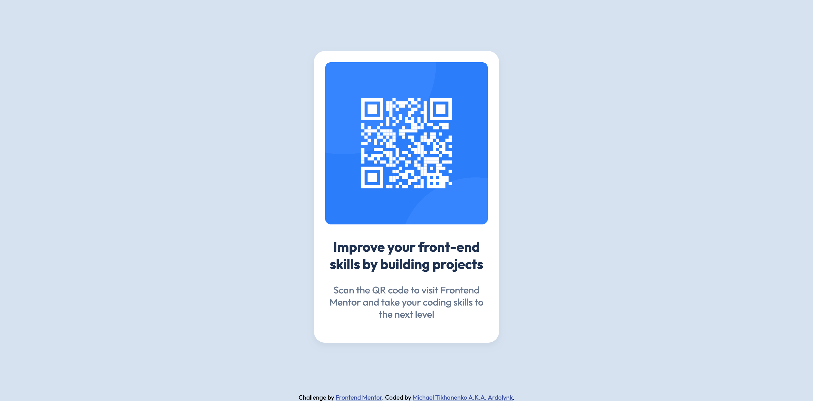

# Frontend Mentor - QR code component solution

This is a solution to the [QR code component challenge on Frontend Mentor](https://www.frontendmentor.io/challenges/qr-code-component-iux_sIO_H). Frontend Mentor challenges help you improve your coding skills by building realistic projects. 

## Table of contents

- [Overview](#overview)
  - [Screenshot](#screenshot)
  - [Links](#links)
- [My process](#my-process)
  - [Built with](#built-with)
  - [What I learned](#what-i-learned)
  - [Continued development](#continued-development)
  - [Useful resources](#useful-resources)
- [Author](#author)
- [Acknowledgments](#acknowledgments)

## Overview

### Screenshot



### Links

- Solution URL: [Add solution URL here](https://github.com/ardolynk-reborn/qr-code-component-main)
- Live Site URL: [Add live site URL here](https://ardolynk-reborn.github.io/qr-code-component-main)

## My process

### Built with

- Semantic HTML5 markup
- CSS custom properties
- Flexbox
- Desktop-first workflow

### What I learned

Flexboxes and viewport sizes could be helpful to align items properly. Here we put attribution info to the page bottom and center the card within the rest.

```html
  <div class="main">
    <div class="content">
      <div class="card">
        <!-- card content -->
      </div>
    </div>
    <div class="attribution">
      <!-- attribution content --->
    </div>
  </div> 
```
```css
.main {
  height: 100vh;
  display: flex;
  flex-direction: column;
  align-items: center;
}

.content {
  height: 100%;
  display: flex;
  flex-direction: column;
  justify-content: center;
}
```

### Continued development

I still need more page-proofing practices before diving deeper into frontend development.

### Useful resources

- [Frontend Web Development Bootcamp Course](https://www.youtube.com/watch?v=zJSY8tbf_ys) - This course contains much useful info about the very basics of frontend development (still far from ideal though).
- [ChatGPT](https://chatgpt.com) - This helped me center the card using CSS.

## Author

- GitHub - [@ardolynk-reborn](https://github.com/ardolynk-reborn)
- Frontend Mentor - [@ardolynk-reborn](https://www.frontendmentor.io/profile/ardolynk-reborn)
- Twitter - [@ardolynk75](https://x.com/ardolynk75)

## Acknowledgments

Special thanks to Zach Gollwitzer (see [Frontend Web Development Bootcamp Course](https://www.youtube.com/watch?v=zJSY8tbf_ys) mentioned above) for letting know about [Frontend Mentor](https://www.frontendmentor.io).
